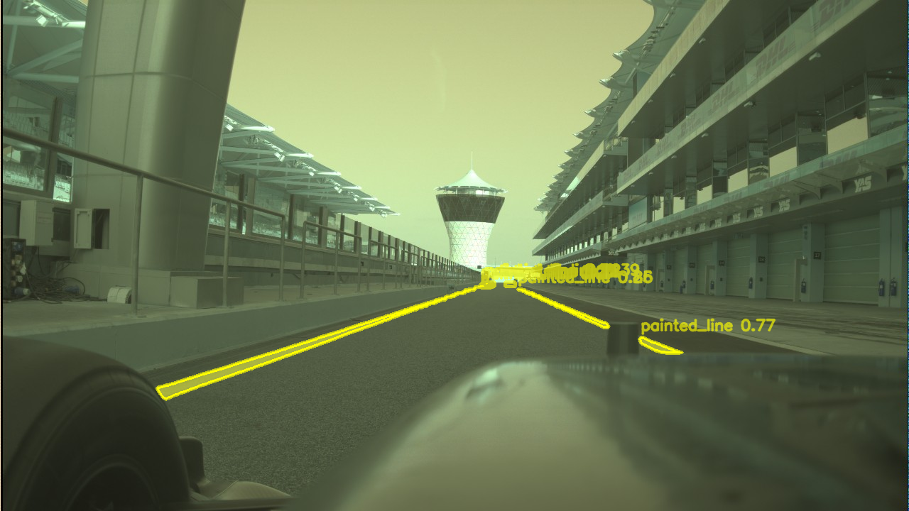
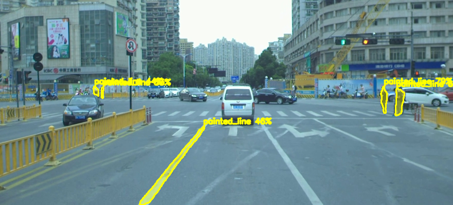
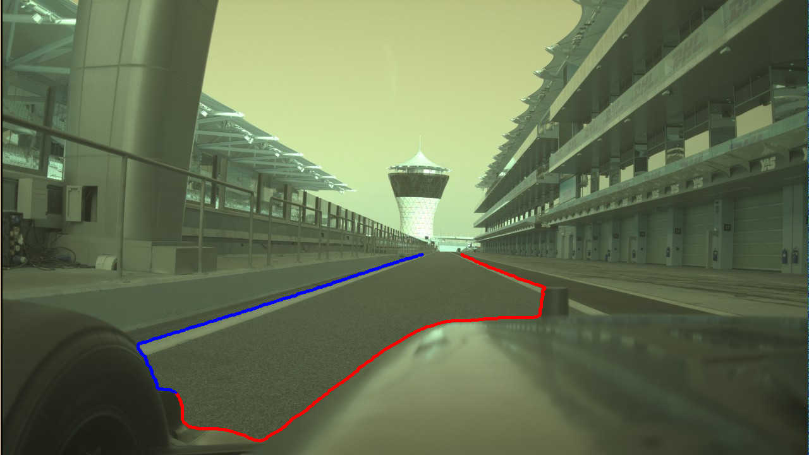
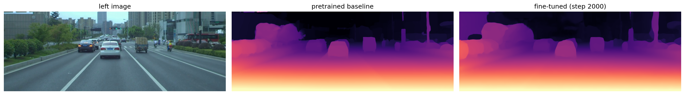

# Racetrack Line 3D Detection Using Camera Data

Bachelor thesis, Constructor University, 2026. Supervised by
Prof. Dr. Dmitry Kropotov. Target application is the A2RL autonomous racing
league at Yas Marina Circuit.

A camera-only stereo pipeline that reconstructs metric 3D racetrack boundaries.
No LiDAR at inference.

```
RF-DETR              2D masks: painted_line, track_edge
      |
RAFT-Stereo          dense disparity
      |
Unprojection         Z = fx * B / d  ->  metric 3D border points
```

LiDAR was used only during development, to build ground truth for evaluating
the depth stage. It is not part of the inference path.



*RF-DETR detecting `painted_line` on the Yas Marina pit lane.*

## Pipeline status: read this before the results

The pipeline does not run end to end on both datasets, and the difference
matters for how the numbers should be read.

| | DrivingStereo | Yas Marina |
|---|---|---|
| Detection (RF-DETR) | works | works |
| Disparity (RAFT-Stereo) | works | works |
| Metric unprojection to 3D | **works** | **does not work** |
| Calibration | real, shipped with the dataset | **none, estimated** |
| Source of reported metric numbers | yes, all of them | no |

**Every metric figure in this repository comes from DrivingStereo**, which ships
real calibration.

**Yas Marina does not reach trustworthy metric output.** The racing team never
supplied camera calibration files. Focal length and baseline in
`config/stereo_yas.json` are estimates, estimated rectification inflates
disparity by roughly 10x, and the resulting point clouds are compressed 4 to 5
times in scale: the pit lane measures about 3 m across where it is about 12 m in
reality. Detection and disparity are sound there; the geometry is not. This is a
data availability problem, not a pipeline correctness problem. Full detail, with
the evidence, in [docs/calibration-limitation.md](docs/calibration-limitation.md).

| | |
|---|---|
|  |  |
| Detection on DrivingStereo, the branch that produces every metric number | Boundary extraction on Yas Marina, which does not reach metric scale |

## Findings

The most useful result here is a negative one, and it is documented in full in
[docs/experiments.md](docs/experiments.md), sourced from
[docs/raft_finetune_colab.ipynb](docs/raft_finetune_colab.ipynb).

**All three RAFT-Stereo fine-tuning runs beat the pretrained Scene Flow baseline
on aggregate disparity error, and all three got worse on the thin structures
this project exists to reconstruct.** The deployed model is therefore
`raftstereo-sceneflow.pth`, the pretrained weights. The fine-tuned checkpoints
are kept as evidence, not deployed.

Disparity, on the notebook's 21-frame DrivingStereo holdout:

| Model | EPE (px) | bad-3 (%) |
|---|---|---|
| **Pretrained Scene Flow (deployed)** | 0.859 | 2.74 |
| Fine-tuned, DrivingStereo only | 0.515 | 0.61 |
| Fine-tuned, DrivingStereo + KITTI | 0.547 | 0.76 |

Read alone that table says fine-tuning worked. It did not. Splitting the error
by pixel type shows why:

| Model | edge EPE | flat EPE | gap |
|---|---|---|---|
| Fine-tuned, DrivingStereo only | 0.561 | 0.519 | 0.042 |
| Fine-tuned, DrivingStereo + KITTI | 0.631 | 0.539 | 0.092 |

Adding more sparse LiDAR-supervised data more than doubled the edge-versus-flat
gap while flat error barely moved. Aggregate EPE is dominated by flat road and
wall pixels, so it rewards smoothing, which is exactly the behaviour that erases
painted lines and curb edges. The cause is supervision quality, not dataset size
and not hyperparameters: sparse LiDAR returns land overwhelmingly on large
planar surfaces, so a network trained against them is never penalised for
smoothing away a thin structure that has no ground truth point on it.



*A DrivingStereo holdout frame. Left: input image. Centre: pretrained Scene Flow
baseline, **which is the deployed model**. Right: the fine-tuned step-2000
checkpoint, which scores the better aggregate EPE of the two, 0.515 against
0.859, and is nonetheless not deployed because it is worse on the thin
structures this pipeline depends on. The centre and right panels are the same
disagreement the table above measures.*

### 3D reconstruction accuracy

| Quantity | Value |
|---|---|
| Median 3D error, all pixels | 21.9 cm |
| Median 3D error, high-gradient pixels | 39.5 cm |
| Median depth-only error (Z) | 21.2 cm |

**These figures are for the fine-tuned step-2000 checkpoint
(`2000_ds_finetune_v2.pth`), not for the deployed model.** The evaluation cell
loads that checkpoint. Do not read 21.9 cm as the accuracy of
`raftstereo-sceneflow.pth`.

**No 3D figure exists for the deployed baseline.** All four 3D evaluation cells
in the notebook load the fine-tuned checkpoint; the baseline was never evaluated
in 3D, only on disparity. The deployed model therefore has no measured metric 3D
accuracy, and the fine-tuned number is not a substitute for one. Producing that
figure means running `src/evaluate.py` against `raftstereo-sceneflow.pth`.

"High-gradient pixels" means a Sobel gradient magnitude above its 90th
percentile, not the RF-DETR boundary masks. It is a proxy for thin-structure
error, measured on image gradient.

### Detection

RF-DETR instance segmentation, two classes. On the 52-image held-out test set at
a 50% confidence threshold:

| Metric | Value |
|---|---|
| mAP@50 | 70.2% |
| Precision | 82.6% |
| Recall | 69.6% |
| F1 | 75.2% |

Per class, `track_edge` reaches 79.0% AP@50 against 62.0% for `painted_line`.
That 17-point gap is the same thin-structure difficulty that shows up in the
disparity and 3D stages: curbs are large objects, painted lines are thin and
fragmented, so a small mask shift costs a large share of an overlap-based score.

Training ran in Roboflow's hosted interface, so no training config exists in
this repository. Dataset construction, the iterative improvement from roughly
56% mAP@50, and the limitations are in
[docs/detection-training.md](docs/detection-training.md).

## Layout

```
src/           the four pipeline stages
tools/         data preparation, MCAP extraction, calibration recovery
experiments/   failed and superseded attempts, kept as records
patches/       diffs against upstream RAFT-Stereo
config/        calibration and run configuration
docs/          findings, the fine-tuning notebook, images
```

## Setup

```bash
pip install -r requirements.txt
pip install torch==2.7.1 --index-url https://download.pytorch.org/whl/cu118
```

RAFT-Stereo is not vendored. Clone it and apply the three patches:

```bash
git clone https://github.com/princeton-vl/RAFT-Stereo
cd RAFT-Stereo && git apply /path/to/patches/*.patch && bash download_models.sh
export RAFT_STEREO_PATH=$PWD
```

The detector runs against a hosted Roboflow model and reads its key from the
environment. The key is never stored in this repository.

```bash
export ROBOFLOW_API_KEY=<your key>          # PowerShell: $env:ROBOFLOW_API_KEY = "<key>"
```

## Running the pipeline

Every script takes `--help`. Signatures below are the real ones.

**1. Detection.** Writes per-class masks for the unprojection stage, an overlay
image, or an annotated video.

```bash
python src/detect.py --input camera_frames/ --masks-out masks/
python src/detect.py --input frame_000050.png --output overlay.png
```

**2. Disparity.** One pair or a directory of matched pairs.

```bash
python src/disparity.py --left l.png --right r.png \
    --checkpoint models/raftstereo-sceneflow.pth --output disp.npy
```

**3. Unprojection.** Dense cloud, or restricted to detected boundaries by
passing the masks from step 1.

```bash
python src/unproject.py --disparity disp.npy --left l.png \
    --calib config/stereo_drivingstereo.json --output cloud.ply

python src/unproject.py --disparity disp.npy --left l.png \
    --calib config/stereo_drivingstereo.json --output borders.ply \
    --masks masks/ --frame-stem frame_000050
```

**4. Evaluation.** Requires a holdout split first. See the next section.

```bash
python tools/make_holdout.py --root datasets/DrivingStereo \
    --holdout datasets/DrivingStereo_holdout --every 400

python src/evaluate.py --holdout-root datasets/DrivingStereo_holdout \
    --manifest config/holdout_manifest.json \
    --checkpoint checkpoints/2000_ds_finetune_v2.pth \
    --calib config/stereo_drivingstereo.json
```

## Reproduction status

**`src/evaluate.py` hard-fails until you build the holdout.** This is
deliberate. `config/holdout_manifest.json` is not committed, because it names
frames in a DrivingStereo tree that is not distributed here. Run
`tools/make_holdout.py` first. The script will not fall back to the full
dataset, because that would silently score the model on frames it may have
trained on.

**Expect a fresh run to differ from the numbers above.** The reported figures
came from the notebook re-deriving a stride over whatever was on disk at the
time. `src/evaluate.py` reads a recorded manifest instead. The notebook itself
disagrees with itself by one frame between cells, which moves bad-3 by 0.14
percentage points; [docs/experiments.md](docs/experiments.md) documents that and
why the manifest exists.

## Tools

Data preparation and MCAP extraction, all with `--help`:

| Script | Purpose |
|---|---|
| `tools/extract_frames.py` | decode camera frames out of an MCAP recording |
| `tools/extract_lidar.py` | decode LiDAR sweeps, named by timestamp |
| `tools/list_topics.py` | list topics, or probe one image message |
| `tools/read_transforms.py` | dump sensor extrinsics from `/tf` and `/tf_static` |
| `tools/project_lidar.py` | project a LiDAR sweep onto a camera frame |
| `tools/sample_frames.py` | sample every Nth frame for annotation |
| `tools/sample_stereo_pairs.py` | stage stereo pairs in KITTI-2015 layout |
| `tools/add_timestamps.py` | write capture timestamps into the pair manifest |
| `tools/crop_dataset.py` | crop the sky off a staged DrivingStereo copy |
| `tools/build_lidar_gt.py` | build sparse LiDAR-derived GT disparity |
| `tools/make_holdout.py` | carve a recorded holdout split |
| `tools/recover_fx.py` | recover focal length against a LiDAR reference |
| `tools/recover_scale.py` | recover metric scale from a road corridor |
| `tools/clean_cloud.py` | statistical outlier removal on a point cloud |
| `tools/view_cloud.py` | view a `.ply` |

## Experiments

`experiments/` holds failed and superseded attempts, each with a header saying
what it was for and what happened. They are records, not maintained code, and
most hardcode paths to data not distributed here. The calibration chain in
particular is the evidence behind
[docs/calibration-limitation.md](docs/calibration-limitation.md).

## Documentation

- [docs/experiments.md](docs/experiments.md), the fine-tuning results, the
  over-smoothing measurement, training commands and known discrepancies
- [docs/calibration-limitation.md](docs/calibration-limitation.md), why Yas
  Marina metric scale is not trustworthy
- [docs/detection-training.md](docs/detection-training.md), the RF-DETR dataset
  and training process
- [docs/annotation-guide.md](docs/annotation-guide.md), labelling conventions
- [docs/raft_finetune_colab.ipynb](docs/raft_finetune_colab.ipynb), the
  fine-tuning notebook with its result outputs preserved
